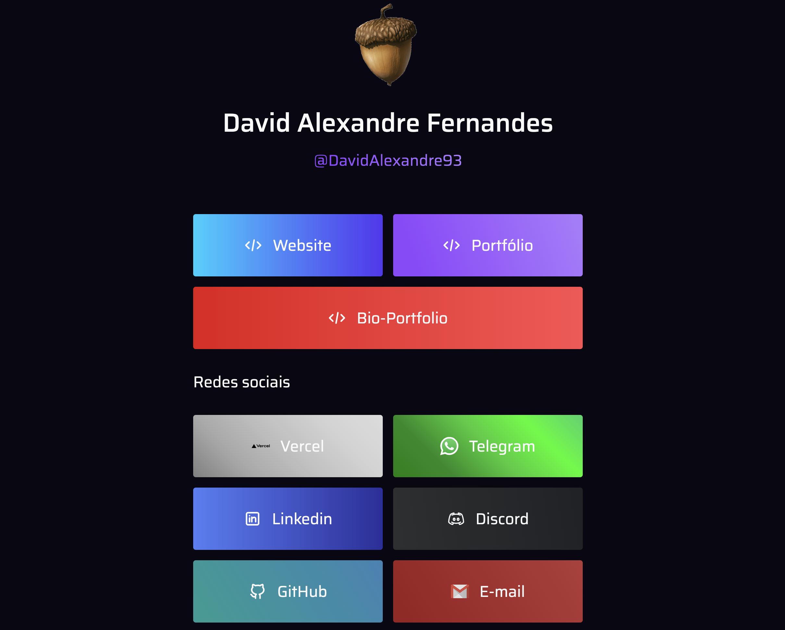

<h1 align="center">
  ☕<br>Bio - David Alexandre Fernandes
</h1>



<h4 align="center"><a href="https://daf-bio.vercel.app/">Clique para visitar o projeto</a></h4>

---

## 🚀 Ambiente de desenvolvimento

- **Node.js:** `20.x` (consulte `.nvmrc`)
- **npm:** versão compatível com Node 20

```bash
nvm use
npm install
```

<h2>🦄 Autor</h2>

<table>
  <tr>
    <td align="center">
      <a href="https://github.com/DavidAlexandre93">
        <br>
        <sub>
          <b>David Alexandre Fernandes</b>
        </sub>
      </a>
    </td>
  </tr>
</table>
